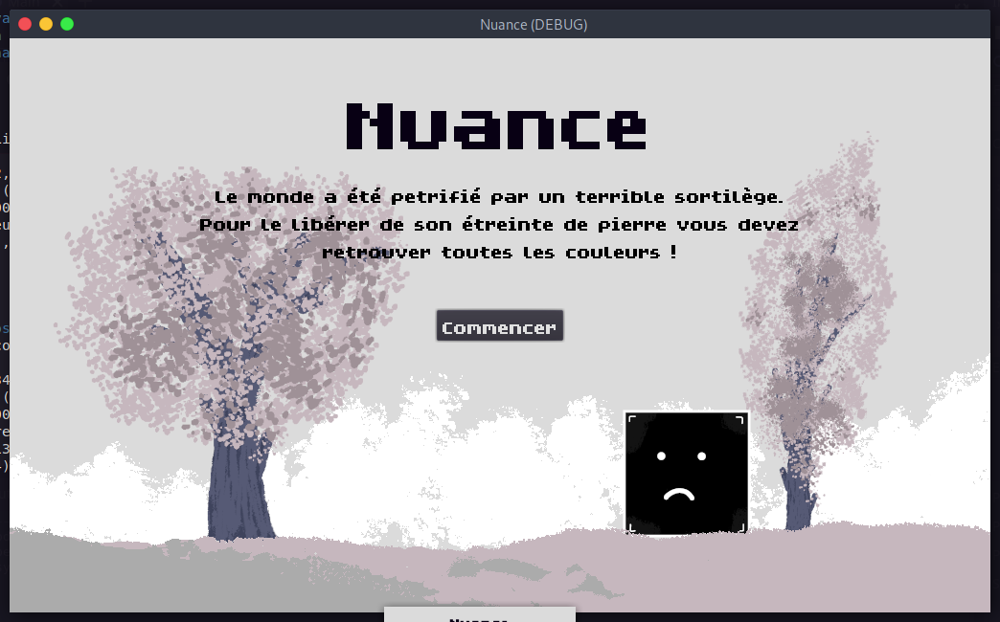
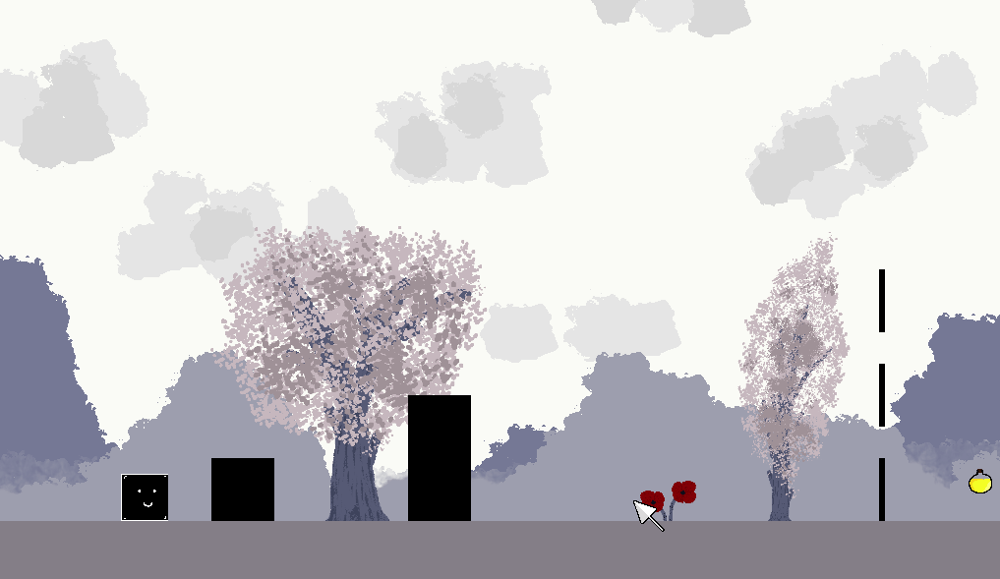
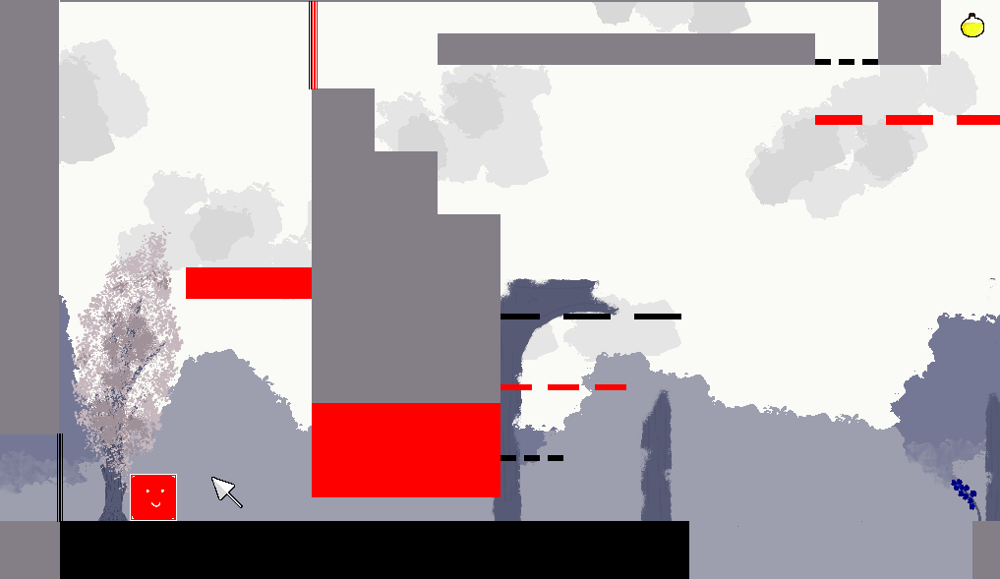
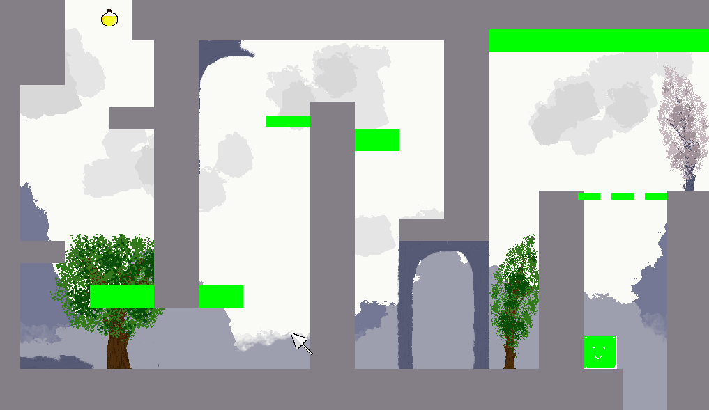

# Nuance

> Game Jam 15 janvier 2022 sur le thème "Un souci de couleur"

Le monde a été petrifié par un terrible sortilège. Pour le libérer de son étreinte de pierre Pixel, notre petit cube, doit retrouver toutes les couleurs !

On peut changer de couleur en cliquant sur un objet de couleur. Se déplacer sur un objet de la même couleur que le personnage le tue. Pour franchir les portes en pointillé il faut être de la même couleur que la porte.

Le bleu rend plus petit. Le but des niveaux est d'atteindre la potion dorée pour aider à restaurer les couleurs.

Le vert permet de sauter plus haut.

